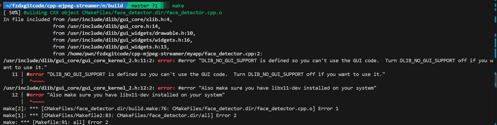

+++
date = '2025-05-16T12:16:44+08:00'
draft = true
title = 'Dlib库找不到怎么办啊'
+++
可恶啊，为什么我cmake编译运行出来的结果怎么报错，说什么dlib库找不到，没有GUI code之类的看不到的话？这里教你一个小妙招，快速解决这个error。
<!--more-->



哇，cmake怎么这么坏啊，不能让他自己找吗？答案是当然可以

以下CMakeLists.txt文件为例，我们想编译一个名为`face_detector`的可执行文件，但是在他的源文件`face_detector.cpp`中用到了dlib库，如果我们直接在build目录下`cmake ..`好无疑问，会出现以上报错信息。

```cmake
cmake_minimum_required(VERSION 3.8.0)
project(examples)

add_executable(face_detector face_detector.cpp)
```
但是往CMakeLists.txt中添加以下代码结果就完全不一样了：

```cmake
cmake_minimum_required(VERSION 3.8.0)
project(examples)
add_subdirectory(/home/pwn/fzdxgitcode/dlib/dlib dlib_build)
add_executable(face_detector face_detector.cpp)
target_link_libraries(face_detector dlib::dlib)
```

第三行的`/home/pwn/fzdxgitcode/dlib/dlib`替换成你dlib库的路径，第四行的`face_detector`替换成你的可执行文件名，第五行的`face_detector`替换成你的可执行文件需要链接的库。

这样就可以编译成功了，快去试试吧！

注：具体情况具体分析哦~不可形而上学，死板地ctrl c+ctrl v，只会让事情变得更遭。

