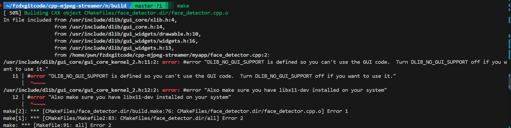
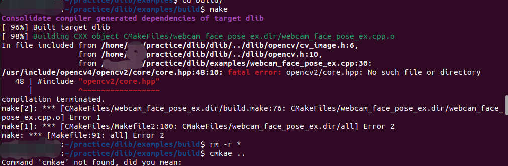
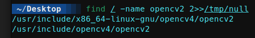
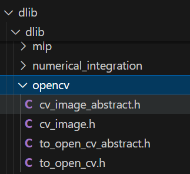
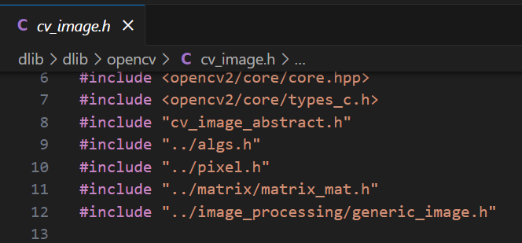

+++
date = '2025-05-16T12:16:44+08:00'
draft = true
title = 'GUI code和core.hpp找不到怎么办啊?'
+++
可恶啊，为什么我cmake编译运行出来的结果怎么报错，说什么dlib库找不到，没有GUI code之类的看不到的话？这里教你一个小妙招，快速解决这个error。
什么？你说opencv2/core/core.hpp也找不到了？
<!--more-->

## 无法使用GUI code



其实是因为没找到链接完全导致的，我们需要将可执行文件与dlib链接起来。

以下CMakeLists.txt文件为例，我们想编译一个名为`face_detector`的可执行文件，但是在他的源文件`face_detector.cpp`中用到了dlib库，如果我们直接在build目录下`cmake ..`毫无疑问，会出现以上报错信息。

```cmake
cmake_minimum_required(VERSION 3.8.0)
project(examples)

add_executable(face_detector face_detector.cpp)
```
但是往CMakeLists.txt中添加以下代码结果就完全不一样了：

```cmake
cmake_minimum_required(VERSION 3.8.0)
project(examples)
add_subdirectory(/home/abc/code/dlib/dlib dlib_build)
add_executable(face_detector face_detector.cpp)
target_link_libraries(face_detector dlib::dlib)
```

第三行的`/home/abc/code/dlib/dlib`替换成你dlib库的路径，第四行的`face_detector`替换成你的可执行文件名，第五行的`face_detector`替换成你的可执行文件需要链接的库。

## core.hpp找不到了



怎么回事，怎么include不了opencv2/core/core.hpp？明明有的啊？！！

解决办法很简单，只需要去dlib/dlib/opencv/cv_image.h中修改包含的头文件路径就行。咱也不知道为啥有的电脑是opencv2，有的电脑是opencv4，所以如果一切正常的话呢，就不要动了，如果出现上面这个报错了，那就按照以下步骤来修改吧。

因为dlib的opencv模块默认的路径是/usr/include/opencv2，但是实际路径不是opencv2而是opencv4，所以需要修改一下。先找找opencv2在哪，使用以下命令：

```bash
find / -name opencv2 2>>/tmp/null
```



确认/usr/include中存在opencv2，打开我们的cv_inmage.h。（因为报错的是cv_image.h!）



cv_image.h中包含的路径是/usr/include/opencv2，将其第6行和第7行修改成以下内容

```cpp
#include <opencv4/opencv2/core/core.hpp>
#include <opencv4/opencv2/core/types_c.h>
```


这样就可以编译成功了，快去试试吧！

注：具体情况具体分析哦~不可形而上学，死板地ctrl c+ctrl v，只会让事情变得更遭。

